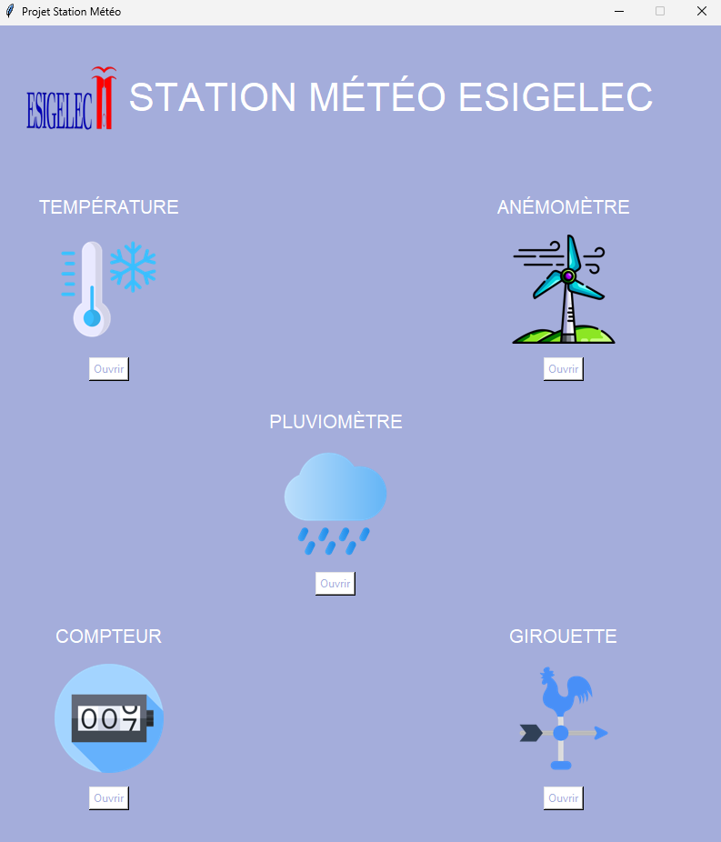
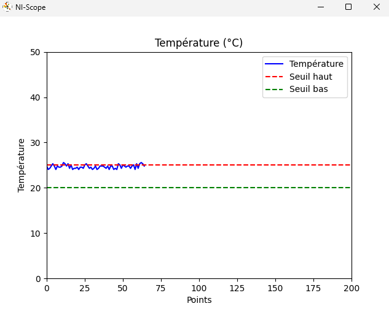
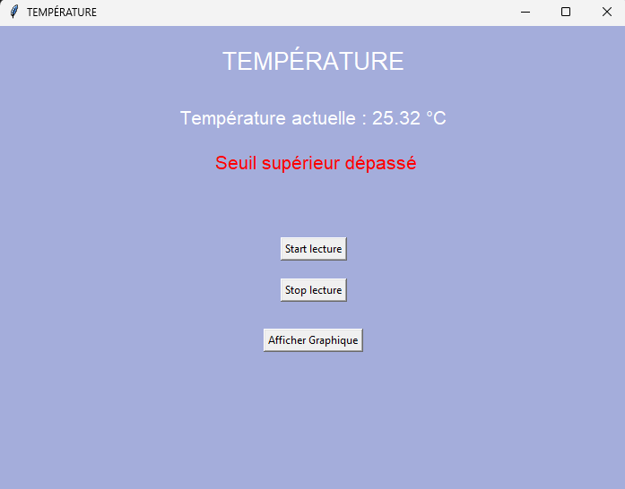
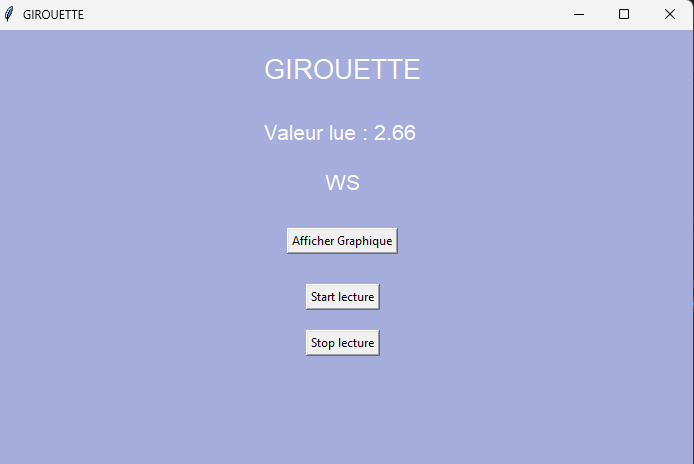
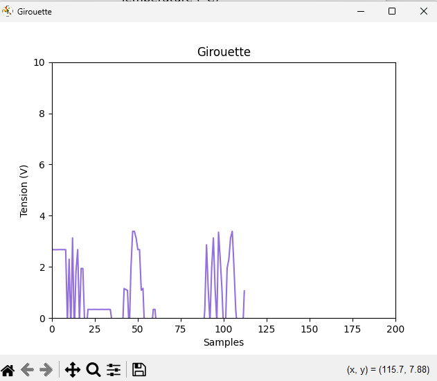
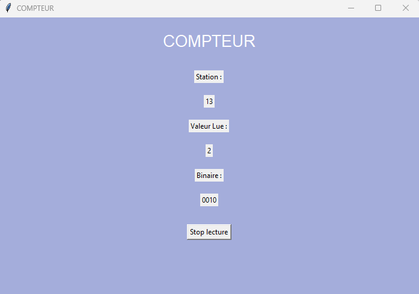
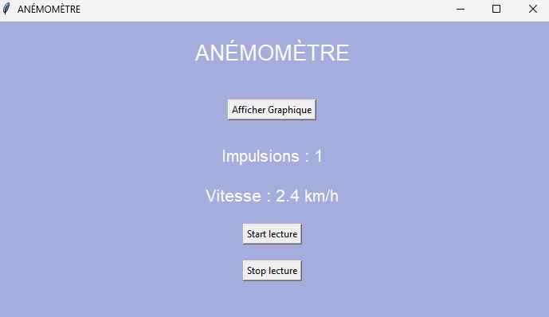
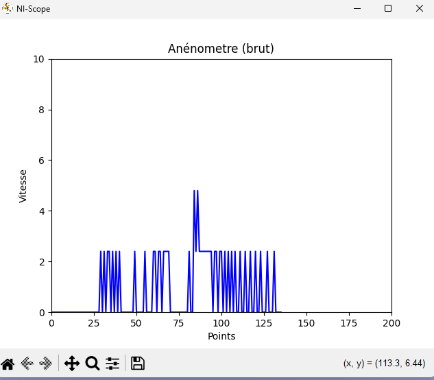
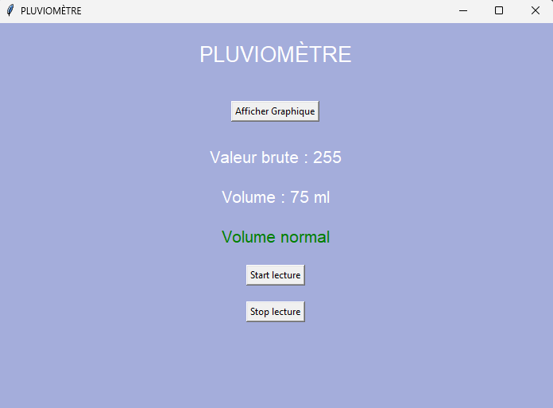
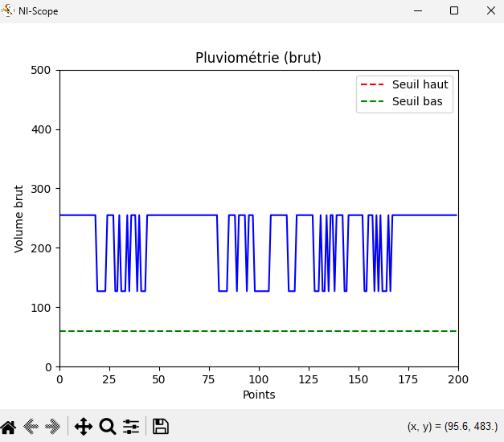

# Station Météo Instrumentée (LabVIEW)

Ce projet consiste en la réalisation d'une application d'acquisition, de traitement de données et d'interface homme-machine (IHM) pour une station météo multi-capteurs développée sous LabVIEW. L'objectif principal était de concevoir une interface ergonomique permettant le suivi en temps réel, l'analyse statistique et l'archivage des données météorologiques.

---

## IHM
* **Interface Ergonomique (Bonus) :** Design de l'IHM globale pensé pour l'ergonomie utilisateur, facilitant la lecture rapide de l'ensemble de la station météo.

#### Vue d'ensemble de l'IHM complète :

## Fonctionnalités par Capteur et Visuels IHM / Scope

### 1. Gestion de la Température
* **Affichage & Calculs :** Affichage de la température en temps réel et calcul automatique du temps passé hors des limites saisonnières définies.
* **Graphique Temps Réel :** Visualisation de la mesure en continu avec affichage des lignes de limites haute et basse directement sur le graphe.
* **Analyse Temporelle :** Graphiques historiques montrant l'évolution de la température sur plusieurs échelles de temps : journée, semaine, mois et année.
* **Navigation :** Possibilité de changer manuellement la date d'affichage de la fenêtre pour consulter l'historique.
* **Sauvegarde :** Enregistrement continu des températures mesurées.

| Vue Scope (Graphes) | Vue Gestion des Seuils |
| :---: | :---: |
|  |  |

---

### 2. Girouette (Direction du Vent)
* **Affichage :** Rendu de la valeur brute de la girouette, affichage de la direction sous forme de chaîne de caractères (Nord, Sud, Est, Ouest, etc.) et intégration d'une boussole visuelle.
* **Graphique :** Visualisation en temps réel de l'évolution de la direction.
* **Sauvegarde :** Enregistrement de l'historique des directions du vent.

| Vue IHM (Boussole) | Vue Scope (Évolution) |
| :---: | :---: |
|  |  |

---

### 3. Compteur (Identification & Statut)
* **Affichage de la Station :** Rendu numérique (Integer) du numéro de la station et affichage binaire.
* **Sauvegarde :** Enregistrement du numéro d'identification de la station.

#### Aperçu de l'affichage du Compteur :

---

### 4. Anémomètre (Vitesse du Vent)
* **Mesures & Graphique :** Affichage de la valeur instantanée et tracé d'un graphique temps réel.
* **Gestion des Pics :** Calcul automatique des pics de vitesse du vent et affichage visuel du pic directement sur le graphique.
* **Sauvegarde :** Enregistrement des mesures continues et des pics de vitesse détectés.

| Vue IHM (Vitesse) | Vue Scope (Tracé des Pics) |
| :---: | :---: |
|  |  |

---

### 5. Pluviomètre (Précipitations)
* **Affichage & Conversion :** Rendu de la valeur du compteur brute et conversion automatique en millilitres (mL).
* **Alarmes :** Système d'alertes visuelles en cas de dépassement de seuils (alarme supérieure et alarme inférieure).
* **Graphique Temps Réel :** Tracé en continu avec visualisation des limites de seuils.
* **Analyse Temporelle & Navigation :** Graphiques d'évolution historiques (journée, semaine, mois, année) avec possibilité de changer la date de la fenêtre d'affichage.

| Vue IHM (Niveaux & Alarmes) | Vue Scope (Graphes Historiques) |
| :---: | :---: |
|  |  |

